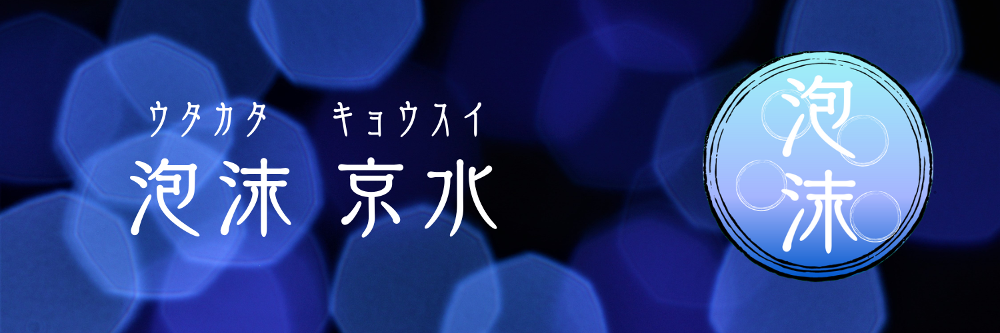

### Hi there 👋

<!--
**Tiamat-KIT/Tiamat-KIT** is a ✨ _special_ ✨ repository because its `README.md` (this file) appears on your GitHub profile.
-->

<h1 align="center">Hi 👋, I'm UtakataKyosui</h1>

<h3 align="left">Connect with me:</h3>

## Languages & Frameworks

  

    <h3>Main Languages</h3>
    

       TypeScript  
       Rust  
       WebAssembly  
    

  

  

    <h3>Sub Languages</h3>
    

       JavaScript  
    

  

  

    <h3>Main Frameworks</h3>
    

       Next.js  
       Loco  
    

  

  

    <h3>Sub Frameworks</h3>
    

       React  
       Firebase  
       Unity  
       Tauri  
    

  

